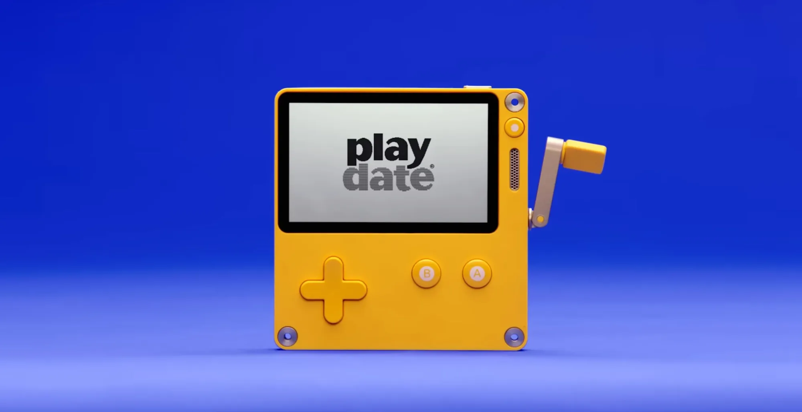

### NOTE:

_This is a pre-released project repository. The "to-do" list is available in the [TODO.md](TODO.md) file. Feel free to contribute or reach out if there are any specific topics you'd like the Playdate Guides to cover!_

More updates coming this week!

-- Franchovy, last updated 26 Oct 2025

# Playdate Guides

### _Your guide to everything Playdate._


_Photo Credit: Panic Inc. - from [Vice](https://www.vice.com/en/article/playdate-handheld-console-is-not-only-getting-a-second-season-but-im-now-endlessly-obsessed-with-it/)_

## Description

**Playdate Guides** hopes to answer every potential question out there about developing for the [**Panic Playdate Console**](https://play.date/). Everything from context to the different programming languages/SDKs hopefully will be covered in this documentation, therefore this will be a constantly evolving, collaborative project.

_Take a look at [Contributing](Contributing.md) if you want to suggest a topic or bring something to Playdate Guides._

### Authors

- **"The Real" Franchovy**
- _Maybe you? See [Contributing](Contributing.md)_

## Table of Contents

1. [Introduction](#introduction)
2. [Useful Links](#useful-links)
3. [Installation](#installation)
4. [Get Started with Playdate](#get-started-with-playdate)
5. [Contributing](#contributing)
6. [License](#license)

## Introduction

The Playdate Console is a handheld retro-style console created by Panic, Inc., a U.S. software and games company based in Portland, Oregon. What sets it apart from other modern consoles is its unforgiving 240x400-pixel (un-backlit) screen, it's simple control scheme, and it's smooth _crank_.

But honestly, who are we kidding, you're probably familiar with the Playdate if you're here. Let me just say - **it's an amazing platform for learning game and software development**. I personally would have rather paid for the playdate and spent a year making games in different programming languages over a 3-year computer science bachelor's degree, but hey, _that's just like, my opinion, man._

The Playdate community, at least for now, is very anti-A.I. (LLMs, specifically). That's great because LLMs are terrible at writing code for Playdate, generating microscopic pixel art images is currently unfeasible with image generation models, and if your ideas were fed to you by a large language model your game probably won't be that novel anyway.

Anyways, enough rambling. If you want to know more about the Playdate's specs, go check out this page: [**Inside Playdate**](https://sdk.play.date/). Save the link if you haven't already - you'll probably need it.

And while we're at it, you might want to bookmark the following links:

## Useful Links

- [**Inside Playdate**](https://sdk.play.date/) - Official **Lua SDK** by Panic - this link also always points to the latest version of the SDK.
- [**Inside Playdate with C**](https://sdk.play.date/Inside%20Playdate%20with%20C.html) - Official **C SDK** by Panic - similar to the above, but for programming in C.
- [**Useful Development Links by Panic**](https://help.play.date/developer/dev-links) - a useful list that I won't need to copy here. Includes videos, books, tools, and all kinds of useful stuff.
- [**Annotations for LuaCATS**](https://luals.github.io/wiki/annotations/#class) - For help writing type-checking annotations in your code.
- [**Programming in Lua**](https://www.lua.org/pil/contents.html) - For both beginners and advanced: Lua is an easy language to learn and a difficult one to master. There's always tons of material to learn and I recommend a full read of this official book of the Lua Programming Language.
- [**Lua Users Wiki**](http://lua-users.org/wiki/LuaDirectory) - Contains more info about both the Lua language and its usage, as well as other libraries, such as the Math library. Generally richer but more verbose than the above, but a handy resource to keep close by. Created by user contributions, just like these guides!
- [**Playdate Guides**](https://github.com/Franchovy/Playdate-Guides) - and of course, yours truly.

## Installation

So let's get started, shall we?

Firstly, download the [**Playdate SDK**](https://play.date/dev/) from the official source. _(Double-check the link to make sure I'm not phishing you.)_ Follow the installation steps, and then make sure the [Playdate SDK Path is linked](https://sdk.play.date/3.0.0/Inside%20Playdate.html#_set_playdate_sdk_path_environment_variable) or you might run into some issues later when running the simulator. For Windows help, check out [this guide](https://devforum.play.date/t/tutorial-compiling-lua-projects-on-windows/3332).

### Choosing your IDE:

- The recommended setup is with [VSCode](https://code.visualstudio.com/Download), or [**VSCodium**](https://vscodium.com/#install), which is the _stripped-down non-Microsoft version of the same software_, avoiding you some of the bloatware. You can install the latter via [command line/package manager](https://vscodium.com/#install-with-brew-mac) as well, which some of you might find more convenient.

  - Make sure to install the [recommended add-ons for VSCode/VSCodium](#recommended-software).

- Alternatively, you can code using [**Nova**](https://nova.app/) – which I have to give credit for - a super easy-to-use IDE, especially for Playdate Development given that it's coming from the creators of the Playdate Console: Panic Inc. You "might" have to buy a subscription after 30 days, however.

- Or, go crazy with the many other IDEs out there if you're slightly more familiar with what you're doing. I started with Notepad++, and I'm currently learning VIM. Don't let this guide stop you short of your dreams, kid.

### Recommended Software:

The other recommended pieces of software to have are:

- **_Highly Recommended:_** [**Git**](https://git-scm.com/install/), the open-source version control tool. It might come pre-installed with your OS, such as MacOS and some Linux distros, so just run in a terminal/command line: `git -v` to check if you already have it.
  - This will allow you to "check out" projects that you find on Github, or other less corporate git project repositories online.
- **_Highly Recommended for Lua:_** [**Playdate LuaCATS**](https://github.com/notpeter/playdate-luacats), the Lua Comments and Type System, smoothly integrates with the Lua Language Server installed via the VSCode Extension or otherwise.
  - To get it running, simply run `git clone https://github.com/notpeter/playdate-luacats` in your preferred location.
  - Don't forget to include a `.luarc.json` file in your projects, see [**the sample one here**](https://github.com/notpeter/playdate-luacats/blob/main/.luarc.json). **Just make sure to fully write the path to the LuaCATS folder on your computer in the "workspace.library" array**, e.g.:

`"workspace.library": ["/Users/peter/code/playdate-luacats"]`

**_Highly Recommended for VSCode/VCodium:_**

**Extensions for VSCode/VSCodium** will help you turn the IDE from a basic text editor into a fully-featured software development platform. If you've got VSCode open, feel free to just type in the following keywords and it should be the first recommendation to show up; no need to go through the link/website.

**I highly recommend** the following extensions:

- **[Lua Language Server by Sumneko](https://marketplace.visualstudio.com/items?itemName=sumneko.lua)** - The "Lua Language Server" runs basic type checking, warning and error support for the lua language, as well as all kinds of useful coding tools and shortcuts that we all take for granted.
- **[Playdate Debug by midouest](https://marketplace.visualstudio.com/items?itemName=midouest.playdate-debug)** - The second option when you type in "Playdate Debug", because the first one [by Orta](https://marketplace.visualstudio.com/items?itemName=Orta.playdate) didn't work for me (feel free to try it though). This helps the IDE communicate with the Playdate Simulator for pausing execution, using breakpoints, logging to console, etc.
- **[Lua Plus by Jeb Alaba](https://marketplace.visualstudio.com/items?itemName=jep-a.lua-plus)** - If I'm being completely honest, I don't remember exactly how this one makes my life better. I just remember installing it at some point and I don't have any problems with it. Perhaps I should have another category for this type of extension.

**_Recommended Extensions for VSCode/VCodium:_**

Although not strictly necessary, these extensions are gems I've come across in my years of software development that I now find indispensable, so I'm sharing them here for you.

- **[Git Graph by mhutchie](https://marketplace.visualstudio.com/items?itemName=mhutchie.git-graph)** - Super useful to have a visual for your projects in Git. Allows for all sorts of git-kung-fu (gung-fu?) that otherwise can be hard to visualize... _and please do NOT install github desktop... just don't..._

- **[Error Lens by Alexander](https://marketplace.visualstudio.com/items?itemName=usernamehw.errorlens)** - If your eyes are failing due to looking extensively at a non-backlit 240x400 black & white screen in poor lighting conditions, you might want this extra bit of highlighting for your errors, comments and warnings in your project. Makes them super easy to spot when you need to... and hard to ignore when you try to! *(Great way to start learning LuaCATS! ...You'll see what I mean...)*

- **[Prettier - Code Formatter by prettier.io](https://marketplace.visualstudio.com/items?itemName=esbenp.prettier-vscode)** - Although not necessary for lua files, JSON does tend to be the second most common file type out there for Playdate projects. And pretty JSON is WAYY nicer than "not pretty" JSON, just check out [this random example](https://devforum.play.date/manifest.webmanifest) by toggling "Pretty Print" to see the difference.

  - To make sure VSCode/VSCodium is using the code formatting, **you can right-click inside a Lua/JSON file respectively, and press the menu option: `Format Document with...`, select `Configure Default Formatter...`, and select "Lua"/"Prettier" respectively**. Do it once for each file type.
  - You can also configure VSCode/VSCodium to auto-format your files on save, which is a super cool and convenient feature. **Go to VSCode Settings, type in `Format on Save`, and make sure the option is toggled**. You can check if it works by adding random spaces/tabs before words and running CTRL/CMD+S to see if the formatter corrects the indentation.

## Get Started with Playdate

### Your first game

Now that you've got all the requirements up and running, let's create our first game!

Start by creating a new folder somewhere on your computer. If I have to teach you that, I think we better stop here.

In VSCode/VSCodium/\<insert your IDE here\>, use "Open Folder" to open up that folder as your project.

**Create a new directory named `source`**. This will be the basis for all the files that will end up in your Playdate game.

Inside `source`, **create a new file named `pdxinfo`**. Paste in the following contents:

```
name=My First Game
author=Your Name Here
description=Mom, my first game is here!!
bundleID=io.mybrand.myfirstgame
version=0.0.1
buildNumber=1
```

You can change all the values after the "=" to fit your creative inspiration. Just don't change the left-hand-side of the "=" or you'll confuse the machine overlords.

Then, create your first programming file by **creating a file in `source` called `main.lua`**. Your project should look like this:

```
(your project name)
├── source
│   ├── pdxinfo
│   ├── main.lua
```

And in terms of files, that's all you need!

...if you want to run `pdc` in the command line, or if you're using Nova. But for VSCode/VSCodium users, we'll need an extra piece:

In the top-level of your project, **create a folder called `.vscode`**. (Note the "dot" at the beginning).

Inside the folder, create two files and copy their contents from below:

1. First, **create a file called `tasks.json`**. This is basically a set of possible things for VSCode to do that will be used in a sec.

```json
// .vscode/tasks.json
{
  "version": "2.0.0",
  "tasks": [
    {
      "type": "pdc",
      "problemMatcher": ["$pdc-lua", "$pdc-external"],
      "label": "Playdate: Build"
    },
    {
      "type": "playdate-simulator",
      "problemMatcher": ["$pdc-external"],
      "label": "Playdate: Run"
    },
    {
      "label": "Playdate: Build and Run",
      "dependsOn": ["Playdate: Build", "Playdate: Run"],
      "dependsOrder": "sequence",
      "problemMatcher": [],
      "group": {
        "kind": "build",
        "isDefault": true
      }
    }
  ]
}
```

2. Second, **create a file called `launch.json`**. This file tells what VSCode should do when you press "Run".

```json
// .vscode/launch.json
{
  "version": "0.2.0",
  "configurations": [
    {
      "type": "playdate",
      "request": "launch",
      "name": "Playdate: Debug",
      "preLaunchTask": "${defaultBuildTask}"
    }
  ]
}
```

Now, your project should look like this:

```
(your project name)
├── .vscode
│   ├── tasks.json
│   ├── launch.json
├── source
│   ├── pdxinfo
│   ├── main.lua
```

Ok, *NOW* let's write some code!

Open up `main.lua` and type out:

```lua
import "CoreLibs/object"
```

That's your first "import" statement, meaning you're telling Lua to include all the basic Playdate functionality. **You need this line for your game to work on Playdate.**

Then, write the following:

```lua
playdate.update()
    print("Hello World")
end
```

I know, basic code example. But this code runs in the **update loop** which should run once-per-tick, or 30 times per second by default on the console.

Now, navigate to the "Run and Debug" tab on the left and hit "Run", and see if your Playdate Simulator opens and the console spits out a few hundred "Hello World"'s to announce its coming into existence in this universe.

If you're all clear, then you can navigate to **[your first sprite tutorial](Guides/Your-first-sprite.md)** to start adding some actual fun stuff into your game.

### Your N+1 game

Now that you know how to create your game from scratch, you can choose between the following options to start your next project:
1. Repeat the same steps as before, perhaps doing it mindfully every day can be good for your mental health.
2. Copy and paste the previous project, erasing extra files and changing variables, but risk forgetting to that one variable in the `pdxinfo` and accidentally overwrite 3 years of coding progress  (jk you can do it if you want)
3. Download a template from a git repository such as [Whitebrim's VSCode Template](https://github.com/Whitebrim/VSCode-PlaydateTemplate) with a simple `git clone https://github.com/Whitebrim/VSCode-PlaydateTemplate` and rename the files in the `pdxinfo` and change whatever you like, 'cause it's your project now.

Honestly I usually go with option 1 or 2, as they are really not difficult to do yourself. Option 3 usually requires a bit of tweaking to get it working as you like, so perhaps you can save the early-stage project by uploading it with git and that way you have your own template, perfect for your own needs!

## Contributing

Check out [Contributing.md](Contributing.md) for some guidelines.

## License

**No license yet... do what you want, while you still can!!!**
